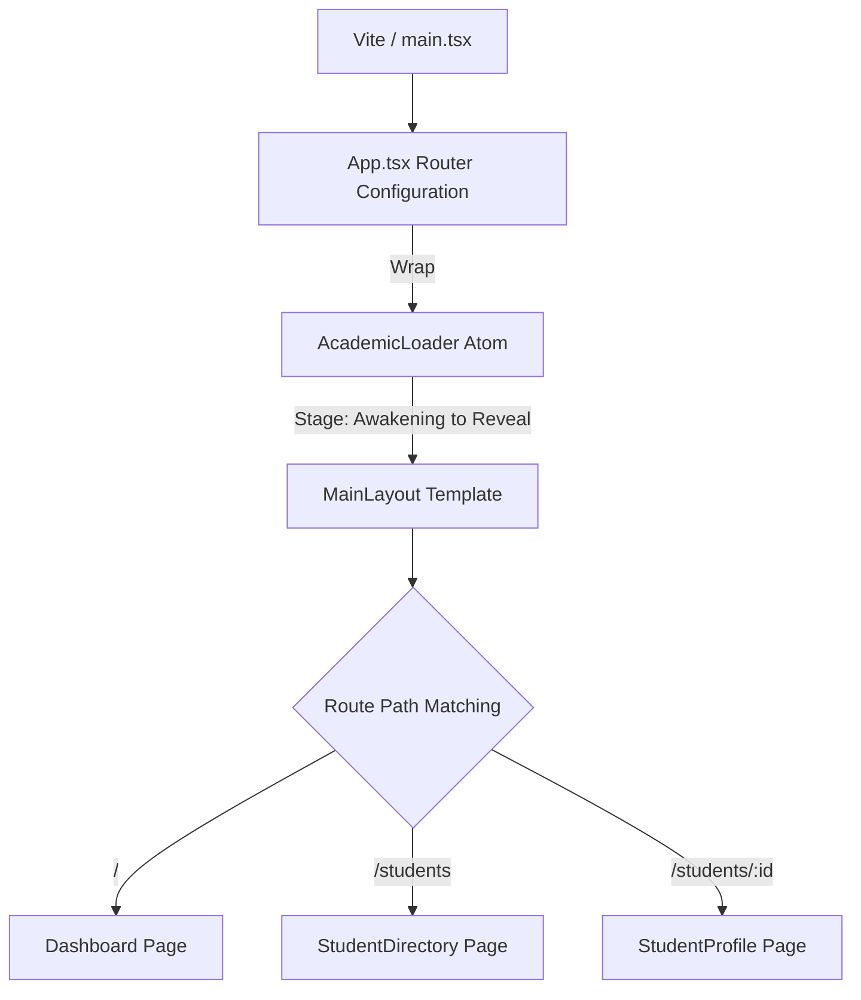

# Zeerostock Frontend Client

This is the React client application for the **Zeerostock Student Management System (SMS)**. It is built as a fast, state-of-the-art Single Page Application (SPA) leveraging React 19, Vite, Tailwind CSS, Framer Motion, and Atomic Design architecture.

---

## 🛠️ Frontend Tech Stack

*   **Core Framework**: React 19, TypeScript 6, Vite 8
*   **Styling**: Tailwind CSS v4.0 (Utilizes CSS variables for theme config)
*   **State Management & Server Cache**: TanStack React Query v5
*   **Routing**: React Router DOM v7
*   **Form Management**: React Hook Form v7 + Zod resolver
*   **Animations**: Framer Motion v12
*   **Data Visualization**: Recharts v3

---

## 🏛️ Atomic Architecture Explanation

To enforce high modularity, scalability, and code cleanups, the directory layout follows the **Atomic Design methodology**:

```text
src/components/
├── atoms/          # Basic, raw UI building blocks
│   ├── Button.tsx           # Spring-animated buttons with loaders
│   ├── Input.tsx            # Custom input wrappers with dynamic validation borders
│   └── AcademicLoader.tsx   # Cinematic preloader asset ("The Knowledge Nexus")
│
├── molecules/      # Simple bonded groups of atoms
│   ├── StudentCard.tsx      # Previews student initials, name, and email
│   └── CommandPalette.tsx   # Global navigation & search modal (Cmd/Ctrl + K)
│
├── organisms/      # Complex stateful component clusters
│   ├── StudentForm.tsx      # Enrollment & update React Hook Form
│   ├── StudentList.tsx      # Paginated directory list grids
│   └── Modal.tsx            # Layered popup overlay container
│
└── templates/      # Layout skeletons positioning modules
    └── MainLayout.tsx       # Manages sidebars, mobile drawer states, and glows
```

### Pages (`src/pages`)
Pages tie components together to form client-side routes:
*   `Dashboard.tsx` (`/`): The root statistics summary dashboard.
*   `StudentDirectory.tsx` (`/students`): Search and filter student listings.
*   `StudentProfile.tsx` (`/students/:id`): Social-style profile showing grade analytics charts.

---

## ⚡ Client Application Flow



---

## ⚙️ Setup & Installation Instructions

### Prerequisites
Make sure **Node.js v18 or later** and **NPM** are installed.

### 1. Installation
Navigate into the `frontend` folder and install packages:
```bash
cd frontend
npm install
```

### 2. Configure Environment variables
Create a `.env` file in the `frontend` root:
```env
VITE_API_URL="http://localhost:5000"
```

### 3. Start Development Server
Run the Vite local development command:
```bash
npm run dev
```
The application will launch on **`http://localhost:5173`**.

### 4. Build for Production
To bundle and compile assets (minifying JavaScript/CSS and validating TypeScript types):
```bash
npm run build
```

---

## 📝 Assumptions Made

1.  **Backend Port**: Assumes the Express API server is active on `http://localhost:5000/api/v1`.
2.  **Mocked Visual Details**: Academic courses (B.Sc Computer Science) and default GPA averages in student lists serve as semantic UI data placeholders.
3.  **Local Storage Cache**: React Query holds cached data for 5 minutes (`staleTime: 5 mins`) to reduce repeated network calls.
